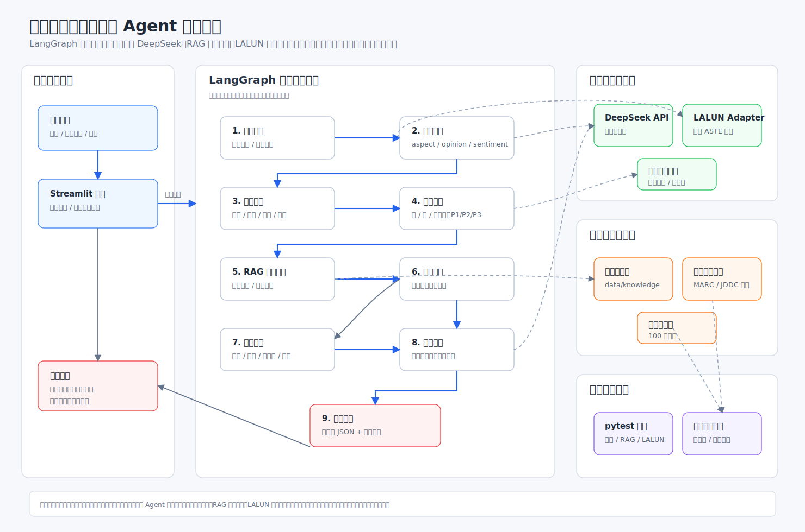

# 电商客服售后运营 Agent

基于 **LangGraph + RAG + DeepSeek API + 细粒度情感分析** 构建的电商客服售后 Agent。

系统可以把用户评论、售后对话或投诉文本，自动转成可执行的客服处理结果：情感三元组、问题分类、风险等级、售后策略、政策依据和客服回复。

> 这个项目不是单轮 Prompt 问答，而是一个可解释、可评估、可扩展的售后运营 Agent 原型。

## Demo

输入：

```text
这个耳机音质不错，但是物流太慢，客服也一直不回复，我有点想投诉。
```

输出要点：

```text
情感三元组：
- 音质 / 不错 / POS
- 物流 / 太慢 / NEG
- 客服 / 一直不回复 / NEG

问题分类：
- 物流问题
- 客服响应问题

风险等级：
- 高风险 / P1

RAG 检索政策：
- 物流延迟与配送异常
- 客服响应与人工升级
- 高风险投诉升级

客服回复：
您好，非常抱歉物流进度和客服响应影响了您的体验。我们已记录您的问题，
并将优先核实物流节点和历史沟通记录。如确认超时或处理不及时，将为您升级人工客服跟进。
```

## Features

- **LangGraph 多节点流程**：将售后处理拆成输入理解、情感分析、问题分类、风险判断、RAG 检索、售后策略、客服回复等节点。
- **细粒度情感分析**：抽取 `aspect / opinion / sentiment` 三元组，定位客户具体不满点。
- **业务问题分类**：识别商品质量、产品体验、物流、客服响应、退款退货、价格权益等售后问题。
- **风险等级判断**：基于业务规则输出低/中/高风险、P1/P2/P3 优先级和触发原因。
- **本地 RAG 政策检索**：从售后政策知识库中检索处理依据，减少大模型随意承诺。
- **客服回复生成**：结合情绪、分类、风险、政策和售后策略生成中文客服话术。
- **批量运营分析**：支持多条评论统计风险分布、高频问题和运营改进建议。
- **LALUN 实验接入**：保留论文相关细粒度情感分析模型适配层，支持后续中文 ASTE 微调。
- **客观评估体系**：内置 100 条人工评估样例和批量评估脚本。
- **Streamlit 页面**：支持单条分析、批量分析和 LALUN 实验展示。

## Architecture



核心流程：

```text
用户输入
  ↓
输入理解
  ↓
细粒度情感分析
  ↓
问题分类
  ↓
风险评估
  ↓
RAG 售后政策检索
  ↓
人工升级判断
  ↓
售后策略生成
  ↓
客服回复生成
  ↓
结果汇总
```

## Quick Start

### 1. 创建环境

```powershell
conda create -n ecommerce-agent python=3.11 -y
conda activate ecommerce-agent
```

### 2. 安装依赖

```powershell
pip install -r requirements.txt
```

### 3. 配置 `.env`

复制配置模板：

```powershell
copy .env.example .env
```

填写模型服务信息：

```text
LLM_API_KEY="your-api-key"
LLM_MODEL_ID="deepseek-chat"
LLM_BASE_URL="https://api.deepseek.com"
LLM_TIMEOUT=60
LLM_TEMPERATURE=0.2

# Optional: 本地 LALUN 项目路径
LALUN_ROOT="D:/agent/LALUN/delivery_105"
```

### 4. 命令行运行

调用大模型分析：

```powershell
python main.py --text "耳机用了三天听筒就坏了，客服一直不处理，我要退货"
```

只使用规则兜底，不调用大模型：

```powershell
python main.py --no-llm --text "这个水杯看上去很实用，其实并不耐用，但是外观还不错"
```

输出完整 JSON：

```powershell
python main.py --json --text "物流太慢了，客服也一直不回复"
```

批量分析：

```powershell
python main.py --batch data/sample_reviews.csv --no-llm
```

检查 LALUN 状态：

```powershell
python main.py --lalun-status
```

### 5. 启动 Web 页面

```powershell
python -m streamlit run src/app_streamlit.py
```

## Evaluation

项目内置 100 条人工评估样例，用于验证问题分类、风险判断和优先级策略。

评估数据：

```text
data/eval/customer_service_eval_100.csv
```

运行评估：

```powershell
python scripts/evaluate_golden_set.py --input data\eval\customer_service_eval_100.csv --output data\eval\customer_service_eval_100_results.csv --errors-output data\eval\customer_service_eval_100_errors.csv --summary-output data\eval\customer_service_eval_100_summary.json
```

当前评估结果：

| 指标 | 数值 |
|---|---:|
| 样本数 | 100 |
| 问题分类命中率 | 94.00% |
| 问题分类完全匹配率 | 59.00% |
| 风险等级准确率 | 100.00% |
| 优先级准确率 | 96.00% |
| 高风险召回率 | 100.00% |
| 高风险精确率 | 100.00% |
| 风险低估率 | 0.00% |
| 风险高估率 | 0.00% |
| 综合得分 | 98.40% |

> 说明：当前评估集规模较小，结果主要用于验证原型流程和规则设计，不代表生产环境泛化效果。

## Tech Stack

| 类型 | 技术 |
|---|---|
| Agent 编排 | LangGraph |
| LLM 应用框架 | LangChain |
| 大模型接口 | DeepSeek API / OpenAI-compatible API |
| RAG | 本地 Markdown 知识库 + 关键词评分检索 |
| 情感分析 | DeepSeek 结构化抽取 / LALUN 实验适配 |
| Web UI | Streamlit |
| 数据处理 | Python CSV / JSON pipeline |
| 测试 | pytest |
| 配置管理 | `.env` + python-dotenv |

## Project Structure

```text
my_agent_project/
├── main.py
├── requirements.txt
├── .env.example
├── data/
│   ├── knowledge/          # 售后政策与客服话术知识库
│   └── eval/               # 人工评估集与评估结果
├── docs/                   # 架构、评估、RAG、LALUN、面试材料
├── scripts/                # 数据处理、评估、LALUN 实验脚本
├── src/
│   ├── app_streamlit.py
│   └── ecommerce_agent/
│       ├── graph.py        # LangGraph 主流程
│       ├── llm_client.py   # DeepSeek/OpenAI-compatible 调用封装
│       ├── lalun_adapter.py
│       ├── agents/         # 情感、分类、风险、策略、回复等节点
│       └── rag/            # 本地 RAG 检索模块
└── tests/                  # pytest 测试
```

## Technical Highlights

- 使用 LangGraph 编排电商售后处理流程，覆盖输入理解、情感分析、问题分类、风险评估、政策检索、策略生成和客服回复。
- 使用本地 RAG 检索售后政策和话术模板，让客服回复具备明确依据，减少不准确承诺。
- 结合细粒度情感分析抽取 `aspect / opinion / sentiment` 三元组，定位客户具体不满点。
- 内置风险评分和优先级规则，识别投诉、维权、质量故障、客服长期不处理等高风险场景。
- 提供 100 条人工评估样例和批量评估脚本，用指标验证分类、风险判断和高风险召回效果。
- 保留 LALUN 适配模块，支持后续将论文相关情感分析模型接入 Agent 主流程。

## Documentation

- [系统架构说明](docs/architecture.md)
- [问题分类体系](docs/classification_taxonomy.md)
- [风险评分规则](docs/risk_scoring_policy.md)
- [RAG 售后政策模块](docs/rag_policy_module.md)
- [评估体系说明](docs/evaluation.md)
- [Demo Cases](docs/demo_cases.md)
- [LALUN 接入说明](docs/lalun_integration.md)
- [LALUN 中文微调路线](docs/lalun_finetuning.md)

## Roadmap

- [x] LangGraph 售后 Agent 主流程
- [x] DeepSeek API 接入
- [x] 细粒度情感三元组抽取
- [x] 问题分类与风险规则
- [x] 本地 RAG 售后政策检索
- [x] Streamlit 演示页面
- [x] 100 条人工评估集与批量评估脚本
- [x] LALUN Adapter 与中文实验入口
- [ ] 扩大真实客服对话评估集
- [ ] 将 RAG 升级为向量检索或混合检索
- [ ] 接入真实订单、物流和工单系统
- [ ] 完成中文 LALUN 微调并接回主流程

## Notes

- `.env`、API Key、本地模型权重和原始大文件数据不应提交到 GitHub。
- 当前项目是可演示原型，不直接代表生产环境售后策略。
- 示例知识库为通用电商售后政策，并非某一家公司的真实官方政策。
