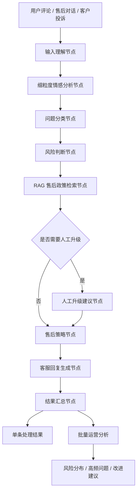

# 基于 LangGraph、RAG 与细粒度情感分析的电商客服售后运营 Agent

这是一个面向电商客服与售后运营场景的智能体项目。系统接收用户评论、售后对话或客户投诉后，自动完成细粒度情感分析、问题归因、风险判断、售后策略生成、RAG 售后政策检索、客服回复生成和批量运营分析。

项目不是一个普通聊天机器人，而是一个可解释、可评估、可扩展的售后运营 Agent 原型。它将大模型能力、业务规则、RAG 知识检索和方面级情感分析结合起来，把非结构化客户反馈转化为可执行的客服处理动作。

## 项目定位

电商售后场景中，客服系统需要解决的不只是“回复一句话”，而是：

- 客户到底在抱怨什么方面：商品、物流、客服、退款、价格权益，还是使用体验。
- 这条反馈是否存在投诉、维权、质量安全、售后阻塞等高风险信号。
- 当前工单应该 P1/P2/P3 哪个优先级处理。
- 客服回复是否有明确政策依据，是否避免错误承诺。
- 多条评论中高频问题是什么，运营团队应该优先改哪里。

本项目围绕这些实际业务问题设计，而不是只做单轮 Prompt 问答。

## 核心能力

| 能力 | 说明 |
|---|---|
| 多节点 Agent 流程 | 使用 LangGraph 将售后处理拆成输入理解、情感分析、分类、风险、RAG、策略、回复等节点 |
| 细粒度情感分析 | 抽取 `aspect / opinion / sentiment` 三元组，定位客户具体不满点 |
| 业务问题分类 | 支持一级类别、业务维度、二级原因、证据文本和命中关键词 |
| 风险等级判断 | 基于业务规则识别低/中/高风险，输出 P1/P2/P3 优先级 |
| 本地 RAG 政策检索 | 检索售后政策和客服话术，让回复有政策依据 |
| 客服回复生成 | 结合情绪、分类、风险、策略和 RAG 政策生成中文客服回复 |
| 批量运营分析 | 对多条评论进行风险分布、高频问题和运营建议统计 |
| LALUN 实验接入 | 保留论文相关 LALUN 模型适配层，支持后续中文 ASTE 微调 |
| 客观评估体系 | 构建 100 条人工评估集，并提供批量评估脚本和指标报告 |
| Web 演示界面 | 使用 Streamlit 提供单条分析、批量分析和 LALUN 实验展示 |

## 系统架构



## LangGraph 流程设计

项目使用 LangGraph 组织主流程，每个节点负责一个明确任务：

| 节点 | 输入 | 输出 | 作用 |
|---|---|---|---|
| `input_understanding` | 原始文本 | 清洗文本、用户意图 | 统一输入格式 |
| `sentiment_analysis` | 清洗文本 | 情感三元组 | 定位具体负面方面 |
| `issue_classification` | 文本 + 情感结果 | 问题分类 | 业务归因 |
| `risk_assessment` | 文本 + 分类 + 情感结果 | 风险等级、分数、规则依据 | 识别高风险售后问题 |
| `policy_retrieval` | 文本 + 分类 + 风险 | RAG 政策上下文 | 检索售后政策和话术 |
| `human_escalation` | 高风险结果 | 升级建议 | P1 工单人工介入 |
| `after_sales_strategy` | 分类 + 风险 + 政策 | 处理动作 | 生成售后处理路径 |
| `reply_generation` | 全部上下文 | 客服回复 | 生成可发送话术 |
| `finalize` | 节点结果 | 完整 JSON | 汇总输出 |

这种拆分方式让系统具备更强的可解释性和可维护性：某个环节出错时，可以定位是情感抽取、分类、风险规则、RAG 检索还是回复生成的问题。

## RAG 售后政策检索

项目新增了轻量级本地 RAG 模块，用于让客服回复参考明确的售后政策，而不是完全依赖大模型自由生成。

知识库文件：

```text
data/knowledge/after_sales_policy.md
data/knowledge/reply_templates.md
```

RAG 模块：

```text
src/ecommerce_agent/rag/knowledge_base.py
src/ecommerce_agent/rag/policy_rag.py
```

当前第一版采用本地 Markdown 知识库 + 关键词评分检索，不依赖外部向量数据库。这样做的原因是：

- 当前知识库规模较小，关键词检索足以覆盖核心售后政策。
- 不需要额外下载 embedding 模型，降低运行门槛。
- 检索过程透明，方便调试和项目展示。
- 后续可以平滑升级为 Chroma、FAISS 或 BM25 + 向量混合检索。

示例：

输入：

```text
耳机用了三天听筒就坏了，客服一直不处理，我要退货
```

系统检索到：

```text
P002 质量问题退换货
T001 质量问题安抚话术
T004 退款退货话术
P004 客服响应与人工升级
```

客服回复会引用政策依据：

```text
我们会参考《P002 质量问题退换货》为您核实处理。
```

## 问题分类体系

系统不是只输出一个粗标签，而是输出更适合业务分析的结构：

```json
{
  "category": "商品质量问题",
  "primary_category": "商品质量问题",
  "business_dimension": "商品",
  "secondary_reasons": ["耐用性不足"],
  "confidence": 0.87,
  "evidence": ["这个水杯看上去很实用，其实并不耐用，但是外观还不错"],
  "negative_count": 1,
  "matched_keywords": ["不耐用", "耐用", "质量"]
}
```

当前支持的一级类别：

| 一级类别 | 业务维度 | 示例二级原因 |
|---|---|---|
| 商品质量问题 | 商品 | 破损/瑕疵、核心故障、耐用性不足、食品新鲜度 |
| 产品体验问题 | 体验 | 核心功能体验、性能/稳定性、感官体验、适配/安装 |
| 物流问题 | 履约 | 发货延迟、配送异常、履约沟通受阻 |
| 客服响应问题 | 服务 | 响应慢或失联、处理拖延、服务态度差 |
| 价格与权益问题 | 权益 | 价格争议、优惠/赠品争议、票据/运费、描述不符 |
| 退换货与赔付问题 | 售后 | 退款诉求、退货/换货诉求、补偿/赔付诉求 |
| 其他反馈 | 其他 | 暂未命中明确售后问题 |

## 风险判断策略

售后风险不能只看情绪强弱。例如“这个水杯看上去很实用，其实并不耐用，但是外观还不错”语气不激烈，但“并不耐用”属于质量和耐用性问题，在售后处理中至少应进入中风险。

因此项目设计了基于业务规则的风险判断机制：

| 风险信号 | 处理原则 |
|---|---|
| 安全隐患、冒烟、严重故障 | 高风险，P1 |
| 投诉、维权、举报、强烈差评 | 高风险或中高风险 |
| 质量问题 + 退货/退款诉求 | 提高风险等级 |
| 客服不处理、长期无人响应 | 提高风险等级 |
| 核心功能异常、耐用性问题 | 至少中风险 |
| 温和物流慢、轻微体验反馈 | 低风险或中风险 |
| 纯正面反馈 | 低风险 |

风险输出包括：

```json
{
  "level": "中风险",
  "score": 67,
  "priority": "P2",
  "should_escalate": false,
  "reasons": ["质量/耐用性问题至少按中风险处理"],
  "triggered_rules": [...]
}
```

## 细粒度情感分析与 LALUN

项目当前默认使用 DeepSeek API 进行中文方面级情感三元组抽取，同时保留 LALUN 适配层。

LALUN 相关工作包括：

- 检查本地 LALUN 代码结构。
- 封装 LALUN 推理适配器。
- 下载中文预训练模型并进行中文实验。
- 处理中文输出乱码问题。
- 设计中文 ASTE 数据准备、伪标注、人工审核和后续微调路线。

当前策略：

```text
主流程默认：DeepSeek / 规则兜底
研究增强：LALUN 中文实验模块
后续升级：中文 ASTE 数据微调后接回主流程
```

这样可以保证项目可稳定演示，同时保留论文模型与 Agent 项目结合的研究亮点。

## 评估体系

项目构建了人工评估集和批量评估脚本，而不是只依赖少量手动测试。

评估文件：

```text
data/eval/customer_service_eval_100.csv
```

评估脚本：

```text
scripts/evaluate_golden_set.py
```

评估指标：

| 指标 | 说明 |
|---|---|
| `category_accuracy` | 问题分类是否至少命中一个人工标签 |
| `category_exact_accuracy` | 分类集合是否与人工标签完全一致 |
| `risk_accuracy` | 风险等级是否与人工标注一致 |
| `priority_accuracy` | P1/P2/P3 优先级是否正确 |
| `high_risk_recall` | 人工高风险样本中系统抓住多少 |
| `high_risk_precision` | 系统判为高风险的样本中有多少确实高风险 |
| `under_risk_rate` | 风险低估比例 |
| `over_risk_rate` | 风险高估比例 |
| `average_score` | 综合评分 |

当前 100 条评估集结果：

| 指标 | 数值 |
|---|---:|
| 样本数 | 100 |
| 问题分类命中率 | 94.00% |
| 问题分类完全匹配率 | 59.00% |
| 风险等级准确率 | 100.00% |
| 优先级准确率 | 96.00% |
| 高风险召回率 | 100.00% |
| 高风险精确率 | 100.00% |
| 风险低估率 | 0.00% |
| 风险高估率 | 0.00% |
| 综合得分 | 98.40% |

运行评估：

```powershell
python scripts/evaluate_golden_set.py --input data\eval\customer_service_eval_100.csv --output data\eval\customer_service_eval_100_results.csv --errors-output data\eval\customer_service_eval_100_errors.csv --summary-output data\eval\customer_service_eval_100_summary.json
```

## 技术栈

| 类型 | 技术 |
|---|---|
| Agent 编排 | LangGraph |
| LLM 应用框架 | LangChain |
| 大模型接口 | DeepSeek API，OpenAI-compatible API |
| RAG | 本地 Markdown 知识库，关键词评分检索 |
| 情感分析 | DeepSeek 结构化抽取，LALUN 实验适配 |
| Web 演示 | Streamlit |
| 数据处理 | Python CSV/JSON pipeline |
| 测试 | pytest |
| 配置管理 | `.env` + python-dotenv |

## 目录结构

```text
my_agent_project/
├── main.py
├── requirements.txt
├── .env.example
├── README.md
├── data/
│   ├── eval/
│   │   ├── customer_service_eval_100.csv
│   │   ├── customer_service_eval_100_results.csv
│   │   ├── customer_service_eval_100_errors.csv
│   │   └── customer_service_eval_100_summary.json
│   └── knowledge/
│       ├── after_sales_policy.md
│       └── reply_templates.md
├── docs/
│   ├── architecture.md
│   ├── classification_taxonomy.md
│   ├── data_pipeline.md
│   ├── demo_cases.md
│   ├── evaluation.md
│   ├── jddc_eval_workflow.md
│   ├── lalun_finetuning.md
│   ├── lalun_integration.md
│   ├── rag_policy_module.md
│   └── risk_scoring_policy.md
├── scripts/
│   ├── evaluate_golden_set.py
│   ├── prepare_chinese_shopping.py
│   ├── create_dialogue_eval_candidates.py
│   ├── pseudo_label_chinese_aste.py
│   ├── run_lalun_chinese_finetune.py
│   └── ...
├── src/
│   ├── app_streamlit.py
│   └── ecommerce_agent/
│       ├── graph.py
│       ├── llm_client.py
│       ├── lalun_adapter.py
│       ├── prompts.py
│       ├── schemas.py
│       ├── agents/
│       │   ├── sentiment_agent.py
│       │   ├── classification_agent.py
│       │   ├── risk_agent.py
│       │   ├── after_sales_agent.py
│       │   ├── reply_agent.py
│       │   └── operation_agent.py
│       └── rag/
│           ├── knowledge_base.py
│           └── policy_rag.py
└── tests/
    ├── test_business_risk_rules.py
    ├── test_golden_evaluation.py
    ├── test_policy_rag.py
    ├── test_lalun_adapter.py
    └── ...
```

## 快速开始

### 1. 创建并激活环境

示例使用 conda：

```powershell
conda create -n ecommerce-agent python=3.11 -y
conda activate ecommerce-agent
```

### 2. 安装依赖

```powershell
pip install -r requirements.txt
```

### 3. 配置环境变量

复制 `.env.example` 为 `.env`：

```powershell
copy .env.example .env
```

填写：

```text
LLM_API_KEY="your-api-key"
LLM_MODEL_ID="deepseek-chat"
LLM_BASE_URL="https://api.deepseek.com"
LLM_TIMEOUT=60
LLM_TEMPERATURE=0.2

LALUN_ROOT="external/LALUN/delivery_105"
LALUN_PYTHON="python"
LALUN_CHINESE_MODEL_DIR="external/LALUN/delivery_105/code/output/zh_ecommerce/model"
LALUN_CHINESE_TOKENIZER_DIR="models/hfl_chinese_macbert_base"
USE_LALUN_ENGLISH=0
```

说明：

- `LLM_API_KEY`：DeepSeek 或其他 OpenAI-compatible 模型服务密钥。
- `LLM_MODEL_ID`：模型 ID。
- `LLM_BASE_URL`：模型服务地址。
- `LALUN_ROOT`：本地 LALUN 项目路径，可选。

### 4. 命令行运行

单条分析：

```powershell
python main.py --text "耳机用了三天听筒就坏了，客服一直不处理，我要退货"
```

不调用大模型，只用规则兜底：

```powershell
python main.py --no-llm --text "这个水杯看上去很实用，其实并不耐用，但是外观还不错"
```

输出完整 JSON：

```powershell
python main.py --json --text "物流太慢了，客服也一直不回复"
```

批量分析：

```powershell
python main.py --batch data/sample_reviews.csv --no-llm
```

检查 LALUN 状态：

```powershell
python main.py --lalun-status
```

### 5. 启动 Web 页面

```powershell
streamlit run src/app_streamlit.py
```

如果系统提示找不到 `streamlit`，可以使用：

```powershell
python -m streamlit run src/app_streamlit.py
```

## 示例输出

输入：

```text
这个耳机音质不错，但是物流太慢，客服也一直不回复，我有点想投诉。
```

系统输出要点：

```text
情感三元组：
- 音质 / 不错 / POS
- 物流 / 太慢 / NEG
- 客服 / 一直不回复 / NEG

问题分类：
- 物流问题
- 客服响应问题

风险等级：
- 高风险 / P1

RAG 检索政策：
- P003 物流延迟与配送异常
- P004 客服响应与人工升级
- P006 高风险投诉升级

售后策略：
- 升级客服工单
- 查询物流节点
- 明确承诺处理时限

客服回复：
您好，非常抱歉给您带来不好的体验，我们已将您的问题优先升级处理。关于您提到的物流和客服响应问题，我们会立即核实物流节点并检查历史沟通记录，请您提供订单号，我们会尽快给出明确处理结果。
```

更多可复现演示案例见：

```text
docs/demo_cases.md
data/demo_cases.json
```

## 测试

运行全量测试：

```powershell
python -m pytest tests
```

当前测试结果：

```text
27 passed
```

测试覆盖内容包括：

- 风险规则边界。
- 问题分类与评估统计。
- RAG 政策检索。
- LALUN 适配器。
- 数据候选集生成与合并流程。
- 规则兜底路径。

## 与普通聊天机器人的区别

| 普通聊天机器人 | 本项目 |
|---|---|
| 单轮问答为主 | 多节点售后业务流程 |
| 回复不可控 | 有分类、风险、策略和政策依据 |
| 难以定位错误环节 | 每个节点可单独调试和评估 |
| 缺少业务指标 | 有人工评估集和量化指标 |
| 容易编造政策 | RAG 检索本地售后政策 |
| 只看整体情绪 | 抽取方面级情感三元组 |

## 工程决策

### 为什么使用 LangGraph

售后场景不是一次简单问答，而是一个多步骤决策流程。LangGraph 可以将流程拆成可控节点，并支持后续加入条件分支、人工升级、RAG 检索和工具调用。

### 为什么第一版 RAG 不直接上向量数据库

当前政策库规模较小，规则和话术结构明确。使用本地关键词检索可以先验证业务闭环，同时降低环境复杂度。等知识库扩大后，再升级 Chroma/FAISS 更合理。

### 为什么要保留规则系统

高风险投诉、质量问题、退款退货等售后判断不能完全依赖大模型自由输出。规则系统可以提供稳定的业务底线，尤其是避免高风险低估。

### 为什么 LALUN 暂时作为实验模块

LALUN 是项目的研究亮点，但中文 ASTE 微调需要足够高质量的标注数据。当前先保证主流程可稳定演示，再逐步推进 LALUN 中文微调和接回主流程。

## 当前局限

- 评估集规模为 100 条，后续应扩展到 150-200 条以上，减少过拟合风险。
- RAG 第一版是本地关键词检索，还不是向量检索。
- LALUN 中文实验模块尚未作为主流程默认情感引擎。
- 当前未接入真实订单、物流和工单系统。
- 客服回复仍需在真实生产环境中加入更严格的合规审核。

## 后续路线图

| 阶段 | 目标 |
|---|---|
| RAG v2 | 使用 Chroma 或 FAISS 做本地向量检索 |
| Hybrid Retrieval | 引入 BM25 + 向量混合检索 |
| LALUN 中文微调 | 用中文电商 ASTE 数据微调 LALUN |
| 二级原因评估 | 给评估集增加 `expected_secondary_reasons` |
| 更大评估集 | 扩展到 150-200 条以上 |
| 真实业务系统接入 | 接入订单、物流、工单和商品知识库 |
| README 展示增强 | 补充截图、架构图和演示视频 |

## 项目总结

这个项目重点展示四件事：

1. 为什么不是普通聊天机器人：它是多节点售后决策流程。
2. 为什么要做风险规则：售后场景中高风险低估比回复不自然更危险。
3. 为什么要加 RAG：客服回复需要政策依据，减少大模型幻觉。
4. 为什么要做评估集：用指标证明系统效果，而不是只展示几个好看的例子。

一句话总结：

```text
这个项目把客户评论和售后对话转化为结构化业务决策，通过 LangGraph 编排 Agent 流程，用细粒度情感分析定位问题，用规则系统判断售后风险，用 RAG 检索政策依据，最终生成可执行的客服处理方案和运营分析结果。
```
